# Sistem Pendaftaran Kelas dengan Kuota Real-time

## Deskripsi singkat

Aplikasi web untuk pendaftaran kelas yang menampilkan kuota real-time.
Siswa dapat mendaftar kelas, melihat sisa kuota, dan menerima konfirmasi.
Admin dapat membuat, mengedit, menghapus kelas, serta melihat daftar peserta.

Aplikasi Live: https://sistem-pendaftaran-kelas.vercel.app/
---

## Daftar Isi

1. [Fitur utama](#fitur-utama)
2. [Stack Teknologi](#stack-teknologi)
3. [Prasyarat](#prasyarat)
4. [Instalasi & Menjalankan Secara Lokal](#instalasi--menjalankan-secara-lokal)
5. [Variabel Lingkungan (.env)](#variabel-lingkungan-env)
6. [Database & Prisma](#database--prisma)
7. [Script NPM Penting](#script-npm-penting)
8. [Menjalankan Pengujian (Testing)](#Menjalankan-Pengujian-Testing)
9. [Panduan Deploy Lengkap](#panduan-deploy-lengkap)
10. [Troubleshooting umum](#troubleshooting-umum)
11. [Kontribusi](#kontribusi)
12. [License](#license)
13. [ERD / Arsitektur Visual](#erd--arsitektur-visual)
14. [Hasil Uji Aksesibilitas Frontend](#Hasil-Uji-Aksesibilitas-Frontend)
15. [Tabel Progres Proyek](#Tabel-Progres-Proyek)

---

## Fitur Utama

* Registrasi & Login berbasis `JWT`.
* Manajemen Kelas (CRUD) oleh `Admin` dan `Staff`.
* Tampilan daftar kelas beserta sisa kuota untuk Siswa.
* Pendaftaran kelas dengan kuota real-time (transaksi atomik dengan Prisma).
* Fitur Lupa & Reset Password.
* Notifikasi email otomatis (Nodemailer) untuk konfirmasi pendaftaran dan reset password.
* `Bonus`: Dashboard analitik sederhana untuk admin dan Staff.

---

## Stack Teknologi

* Frontend: Next.js (App Router), React, TypeScript, Tailwind CSS
* Backend: Next.js API Routes, Prisma ORM
* Auth: `bcryptjs` untuk hashing password, `jsonwebtoken` (JWT) untuk sesi
* Email: `Nodemailer` dengan Gmail App Password
* Database: PostgreSQL
* Testing: `Jest` untuk Unit Test (Backend), `Playwright` untuk E2E Test (Frontend)
* Visualisasi: `Chart.js`

---

## Prasyarat

* Node.js (v18+ direkomendasikan)
* npm (atau yarn/pnpm)
* PostgreSQL (atau gunakan layanan hosted seperti Supabase)
* Git

---

## Instalasi & Menjalankan Secara Lokal

1. Clone repository ini:

```bash
git clone [https://github.com/islamicparadigmaathoriq/sistem-pendaftaran-kelas.git](https://github.com/islamicparadigmaathoriq/sistem-pendaftaran-kelas.git)
cd sistem-pendaftaran-kelas
```

2. Install semua dependencies:

```bash
npm install
```

3. Siapkan file environment: Salin dari contoh yang ada.

```bash
# macOS / Linux
cp .env.example .env

# Windows (PowerShell)
copy .env.example .env
```

4. Konfigurasi `.env`: Buka file `.env` dan isi semua variabel yang dibutuhkan (lihat bagian Variabel Lingkungan).

5. Jalankan migrasi database: Perintah ini akan membuat semua tabel di database Anda sesuai skema Prisma.

```bash
npx prisma migrate dev
```

6. Jalankan server development:

```bash
npm run dev
```

Aplikasi sekarang berjalan di `http://localhost:3000`

---

## Variabel Lingkungan (.env)

File `.env` digunakan untuk menyimpan semua konfigurasi rahasia.:

```env
# Koneksi Database (contoh untuk Supabase)
# PENTING: Gunakan connection string dari "Connection Pooler" dan tambahkan ?pgbouncer=true
DATABASE_URL="postgresql://postgres:[PASSWORD]@[HOST]:6543/postgres?pgbouncer=true"

# Kunci rahasia untuk JWT
JWT_SECRET="your_strong_random_secret_key"

# Kredensial untuk mengirim email (gunakan App Password dari Gmail)
EMAIL_USER=yourgmailaccount@gmail.com
EMAIL_PASS=your_gmail_app_password_without_spaces
```

Catatan: Untuk `EMAIL_PASS`, gunakan App Password dari Google jika memakai Gmail, dan tulis tanpa spasi.

---

## Database & Prisma

*Skema database didefinisikan di `prisma/schema.prisma`.
* Untuk menjalankan migrasi:
```bash
npx prisma migrate dev
```
* Untuk melihat dan mengelola data di database secara visual, jalankan:
```bash
npx prisma studio
```
* Jika ingin menambah seed data, buat skrip seed sesuai kebutuhan dan jalankan `npx prisma db seed` (jika sudah dikonfigurasi).

---

## Script NPM Penting

Berikut adalah beberapa perintah yang sering digunakan dalam proyek ini yang mungkin ada di `package.json`:

```json
{
  "scripts": {
    "dev": "next dev",
    "build": "next build",
    "start": "next start",
    "lint": "eslint",
    "prisma:migrate": "prisma migrate dev",
    "prisma:studio": "prisma studio",
    "test:backend": "jest --config jest.config.backend.js",
    "test:e2e": "playwright test"
  }
}
```

---

## Menjalankan Pengujian (Testing)

Proyek ini dilengkapi dengan pengujian otomatis minimal sesuai persyaratan.

### 1. Unit Test (Backend API)
Tes ini memverifikasi logika API secara terisolasi menggunakan `Jest`.
```bash
npm run test:backend
```
---

### 2. End-to-End Test (Alur Pengguna)
Tes ini menjalankan "robot" (`Playwright`) yang mensimulasikan alur login admin di browser. Pastikan server tidak sedang berjalan di terminal lain saat menjalankan perintah ini.
```bash
npm run test:e2e
```
Untuk melihat laporan visual hasil E2E test, jalankan:
```bash
npx playwright show-report
```
---

## Panduan Deploy Lengkap
Aplikasi ini di-deploy menggunakan Vercel untuk frontend/API dan Supabase untuk database PostgreSQL.

### 1. Persiapan
- Pastikan project sudah di-push ke GitHub.
- Buat akun:
  - [Vercel](https://vercel.com) → hosting frontend + API
  - [Supabase](https://supabase.com) → hosting PostgreSQL
  
---

### 2. Siapkan Database di Supabase:
* Buat proyek baru di Supabase dengan:
1. Tentukan password database (catat baik-baik).
2. Setelah project dibuat, buka **Project Settings → Database**.
3. Salin **Connection String** format `DATABASE_URL`: (pakai yang `transaction pooler`) ke `Environtment Variables` di vercel.

>PENTING: Tambahkan `?pgbouncer=true` di akhir URL untuk stabilitas koneksi dari Vercel.

---

### 3. Deploy Backend + Frontend di Vercel:

1. Login ke Vercel → **New Project** → Import repository dari GitHub.
2. Pilih project `sistem-pendaftaran-kelas`.
3. Atur **Environment Variables** di Vercel:
- `DATABASE_URL` → isi dengan connection string dari Supabase
- `JWT_SECRET` → isi string acak (gunakan [randomkeygen.com](https://randomkeygen.com))
- `EMAIL_USER` → email pengirim (mis. Gmail)
- `EMAIL_PASS` → App Password Gmail (jangan password asli)
4. Klik **Deploy**.

> Catatan: Vercel akan otomatis melakukan deploy setiap kali Anda melakukan `git push` ke branch `main`.

---

### 4. Migrasi Database Prisma ke Supabase
Supaya tabel otomatis dibuat di Supabase:

1. Pastikan `.env` lokal mengarah ke Supabase:
```env
DATABASE_URL="postgresql://postgres:<PASSWORD>@db.<HASH>.supabase.co:6543/postgres?pgbouncer=true"
```
2. Jalankan `npx prisma migrate deploy` dari komputermu (dengan `.env` menunjuk ke Supabase) untuk membuat tabel.

---

## Troubleshooting Umum

* **Error**: `prepared statement "..." already exists`: Solusi: Tambahkan `?pgbouncer=true` di akhir `DATABASE_URL` Anda.

* **Email Tidak Terkirim di Vercel**: Pastikan `EMAIL_USER` dan `EMAIL_PASS` (App Password tanpa spasi) sudah benar di Environment Variables Vercel.

E2E Test Gagal: Pastikan file `.env` sudah ada dan terisi dengan benar. Pastikan juga akun yang digunakan untuk tes ada di database, perannya `ADMIN`, dan kredensialnya cocok.

---

## Kontribusi

Gunakan alur feature branch dan ajukan Pull Request (PR) ke `main`.

---

## License

Proyek ini dibuat untuk keperluan tugas pada mata kuliah Pemrograman Berbasis Web.
Hak cipta © 2025 islamicparadigmaathoriq.

---

## ERD / Arsitektur Visual

Berikut adalah Entity Relationship Diagram (ERD) sistem yang digenerasi dari supabase schema:



**Keterangan simbol:**

| Simbol | Arti |
| :---: | :--- |
| 🔑 | **Primary key** |
| # | **Identity** |
| 👆 | **Unique** |
| ◇ | **Nullable** |
| ◆ | **Non-Nullable** |

---

## Hasil Uji Aksesibilitas Frontend

Pengujian dengan **Lighthouse (Chrome DevTools)** pada tab **Accessibility** menunjukkan semua halaman utama memperoleh skor di atas 90, memenuhi standar aksesibilitas dasar.  
Target skor minimal adalah **≥ 80**.


| Halaman                                   | Skor Lighthouse |
|-------------------------------------------|-----------------|
| Home / Landing (`app/page.tsx`)           | ✅ 100 |
| Login (`app/login/page.tsx`)              | ⚠️ 91 |
| Register (`app/register/page.tsx`)        | ✅ 96 |
| Dashboard Student (`app/dashboard/page.tsx`)| ✅ 94 |
| Dashboard Admin (`app/admin/page.tsx`)    | ✅ 95 |
| Forgot Password (`app/forgot-password/page.tsx`) | ✅ 96 |
| Reset Password (`app/reset-password/page.tsx`)   | ✅ 96 |

---


## Tabel Progres Proyek

| Aspek Penilaian          | Detail Tugas                              | Status |
|---------------------------|-------------------------------------------|--------|
| **Kelengkapan Fitur**     | Register & Login dengan JWT                | ✅     |
|                           | CRUD Kelas untuk Admin (Create, Read, Update, Delete) | ✅ |
|                           | Student bisa melihat daftar kelas + sisa kuota | ✅ |
|                           | Student bisa mendaftar kelas (kuota real-time) | ✅ |
|                           | Admin bisa melihat daftar peserta per kelas | ✅ |
| **Desain & UX**           | Navigasi jelas, responsif                 | ✅     |
|                           | Aksesibilitas dasar (Lighthouse ≥ 91)     | ✅     |
| **Kode Backend**          | Struktur modular API Routes               | ✅     |
|                           | Validasi input & error handling           | ✅     |
|                           | Middleware JWT + role-based               | ✅     |
|                           | Keamanan dasar (hashed password, JWT secret, .env) | ✅ |
| **Kode Frontend**         | State handling (React hooks)              | ✅     |
|                           | Komponen reusable (Popup, API helper)     | ✅     |
|                           | Error handling di form & dashboard        | ✅     |
| **Testing**               | Unit test / E2E test minimal              | ✅     |
| **Dokumentasi**           | README proyek                             | ✅     |
|                           | API Spec (API_SPEC.md)                    | ✅     |
|                           | ERD / Arsitektur Visual                   | ✅     |
|                           | Panduan Deploy                            | ✅     |
| **Deployment & Demo**     | Deploy aplikasi online (Vercel + DB)      | ✅     |
|                           | Video demo aplikasi                       | ✅     |
| **Git Hygiene**           | Commit kecil bermakna, branching, PR/issues | ✅     |
| **Bonus (opsional)**      | Notifikasi email saat sukses daftar       | ✅     |
|                           | Role & izin granular (Admin/Staff)        | ✅     |
|                           | Dashboard analitik                        | ✅     |


---