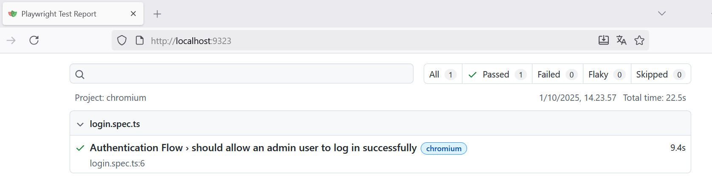

# TESTING_REPORT
# Laporan Pengujian - Sistem Pendaftaran Kelas

Tanggal: 4 Oktober 2025
Versi Aplikasi: 1.0.0
Lingkungan Pengujian: Produksi (Vercel) & Lokal

---

## 1. Ringkasan Pengujian

Dokumen ini merangkum hasil dari serangkaian pengujian yang dilakukan terhadap aplikasi "Sistem Pendaftaran Kelas". Pengujian mencakup tiga area utama:

* **Pengujian Fungsional Manual**: Verifikasi semua alur kerja utama pengguna (Siswa & Admin/Staff) di lingkungan produksi.

* **Pengujian Unit (Backend)**: Verifikasi logika endpoint API secara terisolasi menggunakan `Jest`.

* **Pengujian End-to-End (Frontend)**: Simulasi alur login pengguna admin secara otomatis menggunakan `Playwright`.

**Hasil Keseluruhan**: LULUS. Aplikasi dinyatakan stabil, fungsional, dan memenuhi semua persyaratan yang ditetapkan.

---

## 2. Pengujian Fungsional Manual

Pengujian manual dilakukan langsung pada aplikasi yang telah di-deploy di Vercel untuk memastikan semua fitur berjalan sesuai harapan di lingkungan produksi.

---

### 2.1. Skenario Pengujian

Alur Siswa (Student Journey)
* [✅] Berhasil membuka halaman utama.
* [✅] Berhasil mendaftarkan akun baru.
* [✅] Berhasil login menggunakan akun baru dan diarahkan ke dashboard siswa.
* [✅] Berhasil melihat daftar kelas beserta sisa kuota.
* [✅] Berhasil mendaftar ke sebuah kelas (muncul popup konfirmasi, kuota berkurang, tombol berubah menjadi "Terdaftar").
* [✅] Gagal mendaftar ke kelas yang sama untuk kedua kalinya.
* [✅] Berhasil melihat halaman profil.
* [✅] Berhasil logout.

Alur Admin & Staff (Admin/Staff Journey)
* [✅] Berhasil login sebagai Admin/Staff dan diarahkan ke dashboard admin.
* [✅] Berhasil melihat daftar peserta pada sebuah kelas (termasuk siswa yang baru mendaftar).
* [✅] CRUD Kelas:
    * [✅] Berhasil membuat kelas baru.
    * [✅] Berhasil mengubah data kelas yang ada.
    * [✅] Berhasil menghapus kelas (muncul popup konfirmasi).
* [✅] Berhasil melihat dashboard analitik dengan grafik pendaftaran.

Alur Lupa Password
* [✅] Berhasil meminta link reset password dari halaman login.
* [✅] Berhasil menerima email berisi link reset password.
* [✅] Berhasil mereset password melalui link tersebut.
* [✅] Berhasil login menggunakan password yang baru.

---

### 2.2. Hasil Pengujian Manual

**Hasil: LULUS**. Semua skenario pengujian fungsional manual berjalan dengan sukses tanpa ditemukan bug kritikal.

---

## 3. Pengujian Otomatis (Automated Testing)

Pengujian otomatis dilakukan untuk memastikan kualitas dan keandalan kode, terutama pada logika inti aplikasi.

---

### 3.1. Pengujian Unit (Unit Test) - Backend API

* **Framework**: Jest
* **Tujuan**: Memverifikasi logika endpoint API secara terisolasi, terutama untuk proses autentikasi.
* **Hasil: LULUS**. Semua tes unit yang ditulis berhasil dijalankan.

**Bukti Pengujian (Screenshot)**:

---

### 3.2. Pengujian End-to-End (E2E) - Alur Pengguna

* **Framework**: Playwright
* **Tujuan**: Mensimulasikan alur login pengguna admin secara otomatis di browser untuk memastikan integrasi frontend dan backend berjalan lancar.
* **Hasil**: LULUS. Tes E2E berhasil menyimulasikan login dan memverifikasi pengalihan ke dashboard admin.

**Bukti Pengujian (Screenshot)**:

---